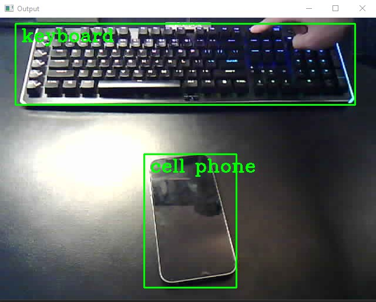
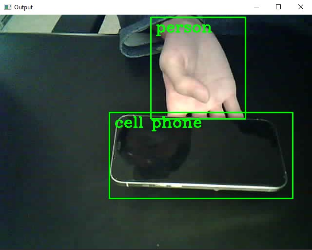
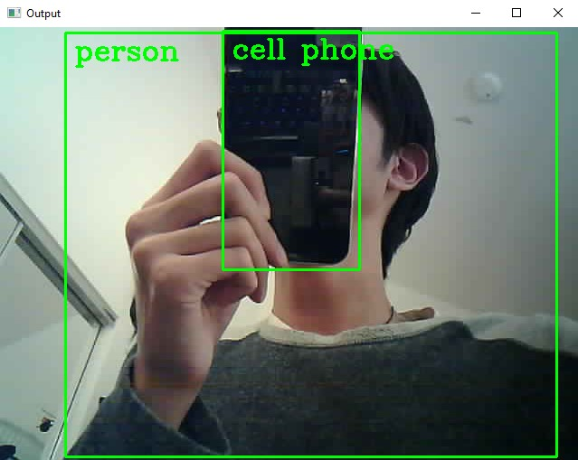
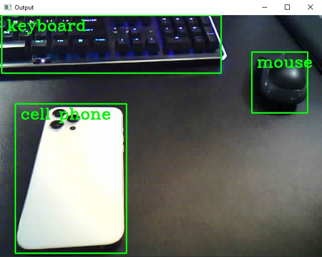
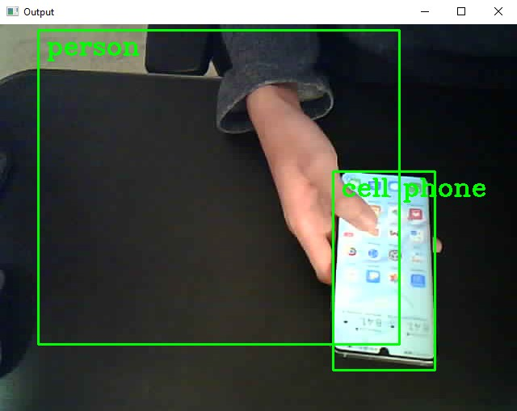
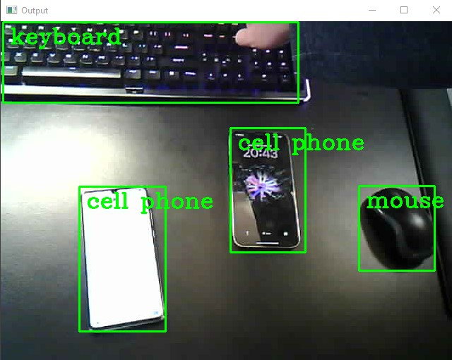

# Final Project
Haozhang(Jim) Chu A16484292

Jean Gorby Calicdan A15955623

## Space Invaders
### YouTube video link
Space Invader Demo: https://youtu.be/CMxRdeafLto

### Improvements
#### Improvement 1: Decoupling Shooting and Moving
**before**

Prior to this improvement, in order to shoot, the user needs to tilt their ESP32 based controller toward the display to
trigger a shot. In order to navigate left and right, the user needs to tile their ESP32 based controller to left or 
right to navigate. As a result, shooting while moving means not only to tile the display toward the display but also
toward the left. It is not only hard to do, also given the way that the code is structured, shooting and moving doesn't
work well.

**after**

In order to achieve shooting while moving, we decided to decouple shooting and moving. Instead of relying on just the
accelerometer orientation for both shooting and moving, we decided to only use acceleration orientation for movement.
As a result, we added a button dedicated to shooting. Therefore, the two actions are decoupled. The button press is 
updated more frequently compared to the accelerometer readings in order to not lose any shooting commands. Since the
movement command is more continuous reading compared to shooting commands.

#### Improvement 2: Smoother Movement
**before**

Prior to this improvement, the moving buffer is often very delayed after playing the game for a bit. As a result, the
user could get stuck moving left for a while, even when they have already tiled their ESP32 based controller right with
the intention of moving left. The controller orientation detection is also very strict, because it requires one
orientation's value to be max in order to register.

**after**

In order to achieve smoother movement, we first start by setting some reference acceleration values. As a result, our
ESP32 based controller doesn't have to start up from a flat surface. So if you are playing space invaders in space, it
should in theory still work for you. After that, we calculate the tilt through math. First, the reference acceleration
values are subtracted from the incoming acceleration data. Next, we would like to obtain the x-axis and y-axis angles.
To calculate this angle, we calculate the L2 norm of the other two axis that we are not observing. As an example, when
checking the y-axis, we would calculate the L2 norm between the x-axis and z-axis. We take the incoming value and divide
it by the calculated L2 norm. Lastly, to get the tiling degrees, we take the arctan() of this value and convert it from
radian to degrees, then we obtain the tile angle we would like. As a result, our movement is smoother.

#### Improvement 3: Removed the need for keyboard
**before**

Prior to this improvement, after running the spaceinvaders.py and space_invaders_controller.py, the user must start the
game by clicking something on the keyboard. To quit the game, the user will need to press esc key.

**after**

In order to remove the need for keyboard, we are using the shooting button to start the game. To end the game, the user
just need to tilt their ESP32 based controller toward the display. Although, the spaceinvaders.py and space_invaders_
controller.py still need to be run, once the game is run the user will only need the ESP32 based controller to interact
with the game, provider the ESP32 based controller with more control and ease of use. Furthermore, unlike the provided
code which could hold in command before the game officially start, our implementation makes sures that the buffer is
empty at the start of the game. This is achieved by waiting for the user input to start the game rather than running
the while loop when the code is run.

### Features:
#### Features 1: Pause/Unpause
1. The game can be paused by placing a finger on the photodetector
2. The game can be resumed by placing a finger on the photodetector again
3. If quitting the game is desired during a pause, the user can hit esc key

In order to implement the pause/unpause feature using photodetector, we continuously send photodetector readings from
the Arduino to the Python file. When no finger is on the photodetector, the reading value is usually high about 32k. On
the other hand, when a finger is on the photodetector, the reading value would be rather low about 5k. As a result, we
can analyze this data on the Python side, once a drop is detected, the client can send a "pause" message to the server
and the game code will call the pause() function.

The pause function is essentially always true while loop, thus the game will be able to get stuck in it, thus achieving
the purpose of pausing the game. Within this while loop we need to first constantly checking for message sent by the
client. If another "pause" message is sent by the client, this will represent that the client has pressed again on the
photodetector with the intention of resuming the game. As a result, if another "pause" message is received from the
client, we will need to break out of this loop to resume the game for our user. One thing that we realized while
implementing this is that our enemy ship will teleport after resuming the game. After taking a look, it turns out that
this is because many of the logic in the game code is time dependent, such as the position of the enemy ship. As a 
result, we also track how much time has elapsed while we are stuck in the while loop, and we subtract this time from the
game's time tracker, so after resuming the game, no teleportation of the enemy ship will occur. Thus, the pause/unpause
feature is implemented.

#### Features 2: Changing sensitivity
1. The user will be able to loop through 3 sensitivity levels by clicking the sensitivity button (right button)
2. Sensitivity level 1 is the default sensitivity which most users will keep
3. Sensitivity level 2 is more sensitive compared to level 1, providing user with good control with less tilting motion
4. Sensitivity level 3 is less sensitive compared to level 2, providing user with immersed feeling while requiring max
tiling

In order to implement the changing sensitivity feature, our improvement of smoother movement came in helpful. To tune
the amount of motion needed to trigger left or right movement, we just need to change the threshold degree of moving 
left or right. After playing and testing, we found that the most comfortable range for us was registering movement
outside -10 degrees and 60 degrees which provided the most natural experience. The resting position is not zero but
rather about 20-30 degrees from our processing. We also narrowed and expanded this interval for sensitivity level 2 and
3 to create a more sensitive and a less sensitive controller.

For adjusting the sensitivity, we stored the different sensitivity threshold into a numpy array sens = np.array( [ [
-10, 60], [0, 40], [-200, 200] ] ). To change the sensitivity, the user just need to press the sensitivity button on
the ESP32 based controller. When the button is pressed, Arduino will send a message to Python and Python upon receiving
that message will loop to the next sensitivity setting. We achieve this by array indexing. Thus, the changing sensitivity
feature is implemented.

#### Features 3: Vibration Upon Hit
1. The buzzer on the ESP32 based controller will buzz when the player's spaceship gets hit

In order to implement the vibration upon hit feature, we looked for where in the code takes care of the player's
spaceship being hit by an invader. This happens within the check_collisions() function. Inside this function, a socket
connection is established between the server and the client. When the player's spaceship is hit by an enemy, the client
(space_invaders_controller.py) will receive a "HIT" message from the server. Then, the client will pass the "HIT" 
message to the Arduino, and upon receiving this message, the Arduino will buzz the buzzer for 1s creating vibration.
Thus, the vibration upon hit feature is achieved.

### Instructions for using the controller
1. First the game needs to be started by running the spaceinvaders.py python program. This will establish a socker 
server which the controller will need for communication
2. Upload the Arduino controller code to the built ESP32 board based controller
3. On a separate terminal, (or if you are using the run button), run the space_invaders_controller.py program, so that
the controller can be connected to the socker server as a client
4. To start the game, no keyboard clicks are needed, one just need to click the left button (shooting button) on the 
ESP32 based controller
5. To navigate your spaceship left or right, the user just need to tile their ESP32 based controller to that direction
6. The right button (sensitivity button) can be used to switch between three sensitivity settings
7. To initiate shooting when an enemy spaceship is in sight, the user can click the shooting button to fire
8. To pause the game and take a short break, the user can put their finger on the photodetector to pause. To resume the
game, the user just need to place their finger on the photodetector again to continue where they left off
9. To end or quit the game, the user can tile their ESP32 based controller toward their display and the game program
will terminate
10. Have fun gaming, coding the game, and finals lol!

## Design Challenge
### YouTube Video Link
Prototype Demonstration: https://youtu.be/bjb9XTIjhfU

Purpose Explanation: https://youtu.be/TZH3K5-Sy20

### Need Discussion
#### What is the use case that you are trying to address?
Case 1: Many people have the bad habit of texting while driving. This is a very dangerous action that people does
without consciously realizing it. Just like how there are other safety warning on cars like the buzzing when the car is
not following the lane properly. Our device could be either built internally to the rearview mirror of a car, or it can
be mounted on the rearview mirror of a car. When a driver unconsciously pulls out their phone wanting to check things on
the phone, our device will buzz to warn the driver that they are committing a dangerous action. Hopefully, they will put
their phone away, and they will be kept safer.

Case 2: During test proctoring, there are usually much more students compared to the proctoring group, and cell phone's
size and technology has made it a very convenient device to commit cheating. Therefore, it would be nice for the test
proctors to have some assistive device on their side protecting academic integrity. Our device can be mounted at certain
locations in a testing environment, when a student take out a cell phone while testing, our device will buzz to get the
proctors attention sending the message that a certain student is breaking academic integrity.

Case 3: Some student are addicted to their phone, and while studying they could not hold themselves accountable for not
using their cell phone, they themselves could be struggling wanting to improve their efficiency, but just unconsciously
uses their cell phone. Our device could warn them to put their cell phone away once they pull it out.

#### Why is this problem worth addressing?
Case 1: After researching online, we found NHTSA data indicating about 400 fatal crashes happen each year as a direct
result of texting and driving. When one considers distracted driving as a whole, the number increases to over 30,000 
each year. Therefore, we are talking about saving human life here, which is very important issue.

Case 2: Academic integrity is a very important matter, as it not only affects the credibility of the university, but
also create a fair environment for every student in the class. Especially in a class that involves curving, other
students will be placed at a huge disadvantage if their peer is cheating and not caught.

Case 3: Being distracted by phone during studying will decrease the efficiency of the student. Studying efficiently is
very important in university due to the amount of course work from each class. If one's productivity is low, one's grade
could be impacted in a negative way, which is also important to students.

#### Who is the intended users?
Case 1: Our intended users are drivers since they are the person that will interact with our device first hand. In
addition, we would like to sell it to some car manufacturer also, because if they build our design directly into the
rearview mirror of a vehicle, the vehicle will be safer. As the users, the drivers don't have to install the device
themselves, which also make the car more compiling to buy.

Case 2: Our intended users are test proctors, test giving institutions, or university. Proctors, institutions, or 
university can set up our device in certain environment and use it on their students as an assistive device to ensure
academic integrity.

Case 3: The intended users are student who wish to increase their productivity through not getting distracted by their
phones while they are studying. 

#### How is your solution addressing the need of the user?
Case 1: Most driver would wish to have a safe trip on the road. Just as there are lane tracking and blind spot detections
on cars to keep the driver safe even when they can see the lane and turn their head to look behind. Our phone distraction
detector addresses the safety need or the drivers warning them about their action of texting and driving.

Case 2: The proctors, testing institutions, and universities want to reduce or eliminate the breaking of academic
integrity because they would like to keep themselves creditable and create a fair environment. Our design helps them to
achieve that goal.

Case 3: Many students that are distracted by phones would consciously desire good grade. As a result, our product will
help them break free from the distraction of a cell phone during their study time, thus their productivity would likely
increase leading to an improvement on grade or a better work-life balance.

Note: Our device has the functionality of turning the buzzer off even when a phone is detected if the user finds the 
buzzing annoying. The device also have an OLED display shown the status of detection.

### Solution Discussion:
#### Finite State Diagram

#### What did you choose?
In order to detect the phone distraction in the above described situations, we choose to build a phone detector using 
ESP32 cam, ESP32 SparkFun Thing Plus, OLED display, button, and buzzer. The ESP32 cam will open up an access point for 
transmitting the video feed that it reads in. Then, Python reads in the video feed and uses dnn_DetectionModel from 
OpenCV and the pre-trained object recognition model to perform object detection. The Detection Model is trained by the 
2020_01_14 coco dataset which contains a variety of label images for training purposes. Then, the video feed is feed 
into this model for object detection. We are also performing Non-Maximum Suppression (NMS) on the model output, so when 
the model are not sure whether to classify one object as A or B, it chooses the one with higher confidence value. For 
example, the object will be classified as A instead of B if A has a higher confidence than B. After classification, if 
only a phone is present or a phone is present with multiple other object, the program will consider a phone is detected,
and send the message "detected" or "undetected" to the ESP32 which will show this message on the OLED display and pass
this information to the ESP32 cam as a voltage signal HIGH representing detected while LOW representing undetected. The
ESP32 cam will buzz the buzzer if a phone is detected and keep the buzzer quiet if no phone is detected. The button 
could override and turn the buzzing off even when a phone is present if the user wish to be undisturbed.

#### Why did you choose it?
We choose the ESP32 cam to work with because it fits the need of our user. It is small enough to be built into a backup
mirror of a car to monitor the driver. It can be used to help with the proctoring of exams, and it can be easily setup
to warn a student to be distracted by their phone.

#### What was your thought process in the design?
We initially started with the idea of distraction detector which will detect whether a phone is present in a student's 
study environment, so we went ahead purchasing ESP32 cam. Further down the line, we realized that student could just 
put their phone away or hide it somewhere if they really wanted to stay focused. As a result, we moved on to a test
proctor environment. Since the size of the ESP32 cam, it can easily be hidden in an exam room to help with the proctoring
of an exam. If a student decides to pull their phone out during an exam (possibly breaking academic integrity), then the
buzzer will ring to tell the proctor. Furthermore, we read on about the amount of fatal car accident caused by text
driving, so we decided that our phone detection system could be sold to the car manufactures and be installed into the
rearview mirror, when a driver subconsciously pulls out their phone while driving, our system will be able to buzz a 
buzzer to warn the driver to look to the road ahead for their safety. Consumer would more likely to purchase a car with
such a builtin safety feature, and car manufactures would very likely to buy our unit to install in all of their cars.

### The Product In Action In Different Scenerios
 #1           |      #2     |          #3 
:-------------------------:|:-------------------------:|:-----------:
 | | 

> Here we can see 1. Phone within a desk, 2. Phone with a person within the same frame, and 3. Phone with more items on desk 

 #4           |       #5     |          #6 
:-------------------------:|:-------------------------:|:-----------:
 | | 

> Here we can see 4. Phone with a more crowded desk, 5. Phone while it is actively being used by a person, and 6. Two Phones  

## Division of Labor
### Part 1: Space Invaders Controller
Improvement 1: Decoupling Shooting and Moving     - Haozhang(Jim) Chu  
Improvement 2: Smoother Movement                  - Jean Gorby Calicdan   
Improvement 3: Removed the Need for Keyboard      - Jean Gorby Calicdan  

Feature 1: Pause/Unpause                          - Jean Gorby Calicdan  
Feature 2: Changing Sensitivity                   - Haozhang(Jim) Chu  
Feature 3: Vibration Upon Hit                     - Haozhang(Jim) Chu  

Recording the video - Jean Gorby Calicdan  

### Part 2: Design Challenge
Purchasing an ESP32CAM board                      - Both  
Modifying the esp32 cam library                   - Both  
Debugging ESP32CAM video feed                     - Both  
Setting up access point and WiFi server           - Haozhang(Jim) Chu  
Finite State Machine development                  - Haozhang(Jim) Chu  
OpenCV dnn_DetectionModel                         - Haozhang(Jim) Chu  
OpenCV NMS algorithm                              - Jean Gorby Calicdan  
Phone detection added to object detector          - Haozhang(Jim) Chu  
Coding and debugging of Bluetooth_receiver (ESP32 SparkFun)  - Haozhang(Jim) Chu  
Syncing up ESP32Cam and ESP32                     - Jean Gorby Calicdan  

Recording the video - Haozhang(Jim) Chu (presenting) Jean Gorby Calicdan (filming)  
